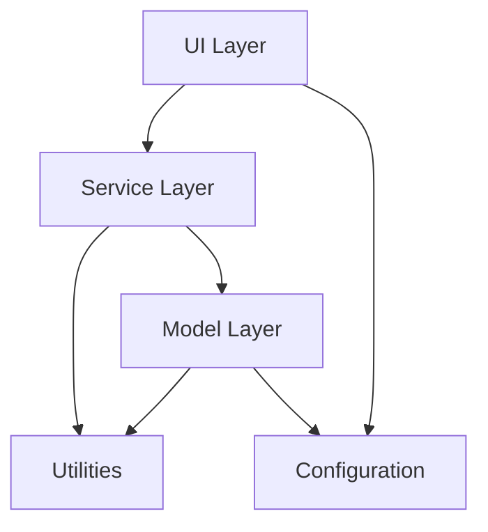

# Mobile LogoCraft - Project Structure

This document provides a comprehensive overview of the Mobile LogoCraft project structure, explaining the purpose of each directory and file, and how different components interact with each other.

## Table of Contents

1. [Project Overview](#project-overview)
2. [Directory Structure](#directory-structure)
3. [Core Components](#core-components)
4. [Component Interactions](#component-interactions)
5. [File Descriptions](#file-descriptions)
6. [Development Workflow](#development-workflow)

## Project Overview

Mobile LogoCraft is a Python desktop application built with PySide6 (Qt) that processes logo images for various mobile platforms and formats. The application allows users to:

- Load images via file browsing or drag-and-drop
- Select from multiple predefined output formats (app icons, splash screens, etc.)
- Remove backgrounds from images automatically
- Process images with proper sizing and formatting
- Generate optimized images for different platforms

The application follows a structured architecture with clear separation of concerns between UI, business logic, and data processing.

## Directory Structure

```
Mobile_LogoCraft/
├── assets/                    # Application assets
│   ├── icons/                 # Application icons
│   └── images/                # Static images used in the application
├── deployment/                # Deployment and build scripts
│   ├── build.py               # Build script for creating executables
│   ├── LogoCraft.spec         # PyInstaller specification file
│   └── setup.py               # Setup script for installation
├── docs/                      # Documentation files
│   ├── FILE_STRUCTURE.md      # Project structure documentation
│   └── UNUSED_CODE.md         # Documentation of unused code
├── logs/                      # Application logs directory
├── resources/                 # Additional resources
├── src/                       # Main source code
│   ├── config/                # Configuration files
│   ├── controllers/           # Application controllers (currently unused)
│   ├── core/                  # Core functionality
│   ├── models/                # Data models and processing logic
│   ├── services/              # Service layer
│   ├── ui/                    # User interface components
│   │   ├── components/        # Reusable UI components
│   │   └── theme/             # Theming and styling
│   ├── utils/                 # Utility functions
│   ├── __init__.py            # Package initialization
│   └── main.py                # Application entry point
├── tests/                     # Test files
│   ├── assets/                # Test assets
│   │   ├── output/            # Test output directory
│   │   └── test_images/       # Test input images
│   ├── __init__.py            # Test package initialization
│   └── various test files     # Different test modules
├── .clinerules                # Project-specific rules
├── .gitignore                 # Git ignore file
├── check_theme_keys.py        # Script to check theme color keys
├── requirements.txt           # Python dependencies
├── run.py                     # Main application launcher
├── run_app.ps1                # PowerShell script to run the application
└── config.json.bak            # Backup configuration file
```

## Core Components

### 1. Application Entry Points

- **run.py**: The main launcher script for the application.
- **src/main.py**: The main entry point for the application. Initializes the Qt application, sets up error handling, and launches the main window.

### 2. User Interface (UI)

- **src/ui/main_window.py**: The main application window that integrates all UI components and manages the overall application flow.
- **src/ui/components/**: Reusable UI components:
  - **drop_zone.py**: Handles drag-and-drop functionality for image files
  - **file_section.py**: Manages file input/output path selection
  - **format_selector.py**: Grid-based interface for selecting output image formats
  - **progress_indicator.py**: Shows processing progress and status
  - **background_removal_option.py**: UI component for enabling background removal

### 3. Models

- **src/models/base.py**: Base class with shared configuration and validation for image processors
- **src/models/image_processor.py**: Handles standard image processing operations
- **src/models/push_processor.py**: Specialized processor for push notification icons
- **src/models/background_remover.py**: Handles background removal using various methods

### 4. Services

- **src/services/image_processing_service.py**: Orchestrates image processing operations, managing the workflow between different processors

### 5. Configuration

- **src/config/formats.py**: Centralized format definitions for all image formats

### 6. Utilities

- **src/utils/file_utils.py**: File handling utilities
- **src/utils/image_utils.py**: Image manipulation utilities
- **src/utils/logging.py**: Logging configuration and utilities

### 7. Core

- **src/core/error_handler.py**: Centralized error handling

## Component Interactions

The application follows a layered architecture with clear separation of concerns:



### Data Flow

1. **User Input Flow**:
   ```
   User → UI Components → Main Window → Image Processing Service → Image Processors → File System
   ```

2. **Image Processing Flow**:
   ```
   Input Image → Image Processing Service → Specific Processor (Standard/Push/Background Removal) → Output Images
   ```

### Key Interactions

1. **Main Window and UI Components**:
   - Main Window integrates all UI components (DropZone, FormatSelector, BackgroundRemovalOption, etc.)
   - Components emit signals that the Main Window handles

2. **UI and Services**:
   - Main Window calls the Image Processing Service when the user clicks "Process Images"
   - Service returns processing results that the UI displays

3. **Services and Models**:
   - Image Processing Service delegates to specific processors based on format and options
   - Models implement the actual image processing logic

4. **Background Removal Integration**:
   - BackgroundRemovalOption UI component allows users to enable/disable background removal
   - When enabled, the Image Processing Service uses the BackgroundRemover before standard processing
   - Different removal methods can be selected based on image characteristics

5. **Configuration and Models**:
   - Models use centralized format configurations from formats.py
   - This ensures consistent settings across the application

## File Descriptions

### Source Code (src/)

#### Main Application

- **main.py**: Application entry point that initializes the Qt application, sets up error handling, and launches the main window.

#### Configuration (config/)

- **formats.py**: Defines all image format specifications including dimensions, background colors, and quality settings.

#### Models (models/)

- **base.py**: Base class with shared configuration and validation logic for all image processors.
- **image_processor.py**: Handles standard image processing operations like resizing, format conversion, and quality optimization.
- **push_processor.py**: Specialized processor for creating push notification icons with specific requirements (white silhouette on transparent background).
- **background_remover.py**: Implements various background removal methods including contour detection, thresholding, chroma key, and GrabCut.

#### Services (services/)

- **image_processing_service.py**: Orchestrates the image processing workflow, selecting the appropriate processor based on format and managing batch operations.

#### UI (ui/)

- **main_window.py**: Main application window that integrates all UI components and manages user interactions.
- **widgets.py**: Common widget definitions and utilities (mostly unused, see UNUSED_CODE.md).

##### UI Components (ui/components/)

- **drop_zone.py**: Custom widget for drag-and-drop file handling with visual feedback.
- **file_section.py**: Widget for managing file input/output paths with browse buttons.
- **format_selector.py**: Grid-based selector for output formats with detailed information.
- **progress_indicator.py**: Shows processing progress and status messages.
- **background_removal_option.py**: UI component for enabling/disabling background removal with user-friendly explanations.

##### UI Theme (ui/theme/)

- **colors.py**: Defines color schemes and theme constants.
- **manager.py**: Manages theme application and switching.

#### Utilities (utils/)

- **file_utils.py**: File handling utilities for path manipulation, validation, etc.
- **image_utils.py**: Image manipulation utilities beyond the core processing logic.
- **logging.py**: Configures application logging with appropriate levels and formats.

#### Core (core/)

- **error_handler.py**: Centralizes error handling with custom exceptions and formatting.

### Tests (tests/)

- **test_image_processor.py**: Unit tests for the image processor.
- **test_push_icon.py**: Tests for push notification icon generation.
- **test_gui.py**: UI component tests.
- **test_integration.py**: End-to-end tests for the complete workflow.
- **test_background_removal.py**: Tests for background removal functionality.
- **process_test_images.py**: Script to process test images for manual verification.
- **verify_output.py**: Utility to verify output image quality and correctness.

### Root Scripts

- **run.py**: Main launcher script that sets up the Python path and starts the application.
- **run_app.ps1**: PowerShell script to run the application from the correct directory.
- **check_theme_keys.py**: Utility script to check for missing theme color keys in UI components.

## Development Workflow

### Image Processing Pipeline

1. **Input Validation**:
   - File format validation
   - Dimension validation
   - Size validation

2. **Format Selection**:
   - User selects desired output formats
   - Each format has predefined dimensions and settings

3. **Background Removal (Optional)**:
   - If enabled, removes white backgrounds using the selected method
   - Creates transparency in the image

4. **Image Processing**:
   - For each selected format:
     - Resize image while maintaining aspect ratio
     - Apply format-specific processing (transparency, background color)
     - Save to output directory with appropriate naming

5. **Special Processing**:
   - Push notification icons undergo additional processing:
     - Convert to white silhouette on transparent background
     - Apply edge detection and contrast enhancement
     - Optimize for small size display

### Background Removal Methods

The application supports multiple background removal methods:

1. **Contour Detection** (Default):
   - Optimized for logos and app icons with distinct edges
   - Uses edge detection and contour finding algorithms
   - Best for most logo processing tasks

2. **Thresholding**:
   - Simple and fast method
   - Works well for high-contrast images
   - Less precise than contour detection

3. **Chroma Key**:
   - Optimized for images with colored backgrounds
   - Similar to green screen technology
   - Good for images with consistent background color

4. **GrabCut**:
   - Most precise but slowest method
   - Better for complex images with subtle edges
   - Uses advanced segmentation algorithms

### Adding New Formats

To add a new format:

1. Add format specification to `src/config/formats.py`
2. If special processing is needed, extend the appropriate processor class
3. Update UI components if necessary (e.g., format selector)

### Testing

The project includes comprehensive tests:
- Unit tests for individual components
- Integration tests for the complete workflow
- Visual verification tools for manual quality assessment

Tests use a set of standard test images located in `tests/assets/test_images/`.
